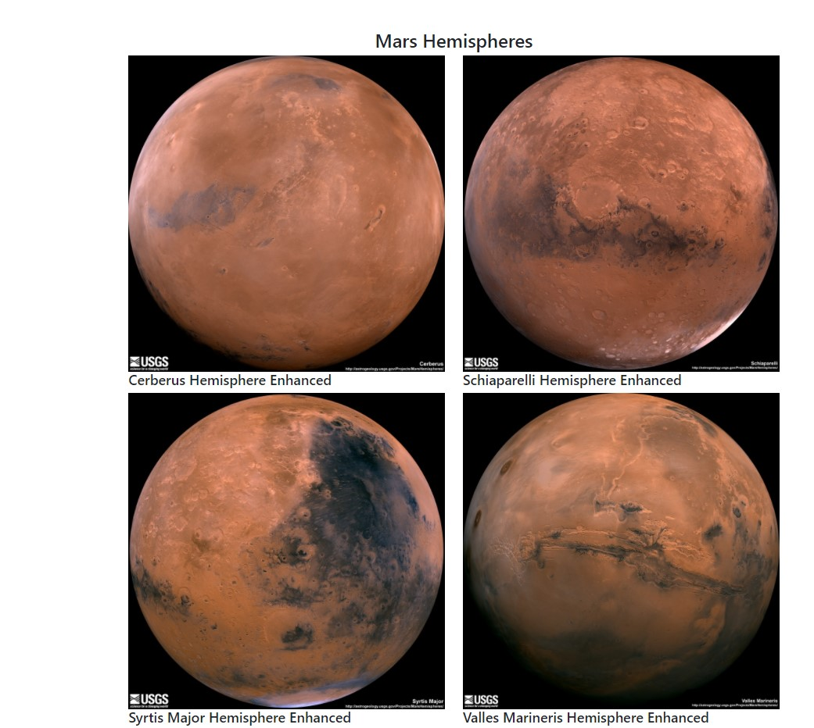

# web-scraping-challenge

In this challenge, you will observe a web application that scrapes various websites for data related to NASA and Mars. It will also display the information in a single HTML page. Let's take a look.

### To begin

1.  I created a new repository for this project called `web-scraping-challenge`. 

2. Cloned `web-scraping-challenge` to my computer.

3. Create a directory for the web scraping challenge. Use a folder name to correspond to the challenge: **Missions_to_Mars**.

4. Added all notebook files and flask app to this folder.

5. Push the above work to GitHub.

## Step 1 - Scraping

Completed the initial scraping using Jupyter Notebook, BeautifulSoup, Pandas, and Requests/Splinter.

* Create a Jupyter Notebook file called `mission_to_mars.ipynb` and use this to complete all of your scraping and analysis tasks.

* I scraped the following: NASA Mars News, JPL Mars Space Images - Featured Image, Mars Facts, and Mars Hemispheres.

## Step 2 - MongoDB and Flask Application

Created a new HTML page that displays all of the information that was scraped using MongoDB with Flask templating.

## Step 3 - Submission
Submitted all work to BootCampSpot.